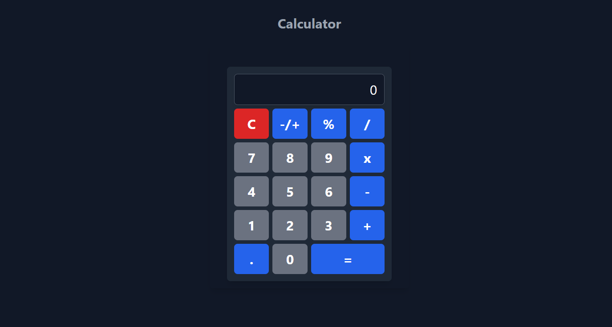

# Calculator

A modern calculator application built with React, Vite, and Tailwind CSS. The application features basic arithmetic operations, including addition, subtraction, multiplication, division, and percentage calculations. It also supports floating-point arithmetic, handles negative numbers effectively, and has a responsive design.

## Features

- Basic arithmetic operations: `+`, `-`, `*`, `/`
- Percentage calculations (`%`)
- Floating-point arithmetic
- Handling of negative numbers
- User-friendly interface with responsive design

## Technologies Used

- **React**: A JavaScript library for building user interfaces.
- **Vite**: A fast build tool and development server.
- **Tailwind CSS**: A utility-first CSS framework for styling.
- **MathJS**: A library for mathematical operations and evaluations.

## Installation

To set up this project locally, follow these steps:

1. **Clone the repository:**

    ```bash
    git clone https://github.com/mitosz11/calculator.git
    cd calculator
    ```

2. **Install dependencies:**

    Ensure you have [Node.js](https://nodejs.org/) installed. Then run:

    ```bash
    yarn
    ```

3. **Start the development server:**

    ```bash
    yarn dev
    ```

    Open your browser and go to `http://localhost:5173` to see the calculator in action.

## Usage

1. **Basic Operations:** Click on the number buttons to enter digits and use the operator buttons (`+`, `-`, `*`, `/`) to perform calculations.
2. **Percentage Calculation:** Use the `%` button to calculate percentages.
3. **Floating-Point Arithmetic:** Use the `.` button to enter decimal numbers.
4. **Negative Numbers:** Toggle the sign of a number using the `-/+` button. Note that the sign toggle will apply to the current number after an operator has been pressed.
5. **Clear:** Use the `C` button to reset the calculator.
6. **Calculate:** Click the `=` button to get the result of the arithmetic expression.

## Project Structure

- **`src/components/`**: Contains React components for the calculator.
  - `Calculator.jsx`: Main calculator component.
  - `Button.jsx`: Button component used for calculator buttons.
  - `Display.jsx`: Display component for showing the current input and results.
- **`index.css`**: Contains Tailwind CSS styles and custom styles.
- **`App.jsx`**: Main application component that renders the calculator.


## Contact

For any inquiries, you can reach out to [bsalgoi@gmail.com](mailto:your-email@example.com).

## Demo



---

Thank you for checking out the Calculator project!
